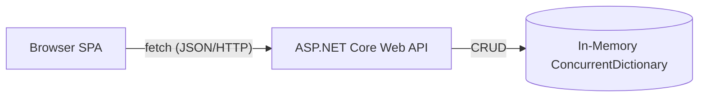
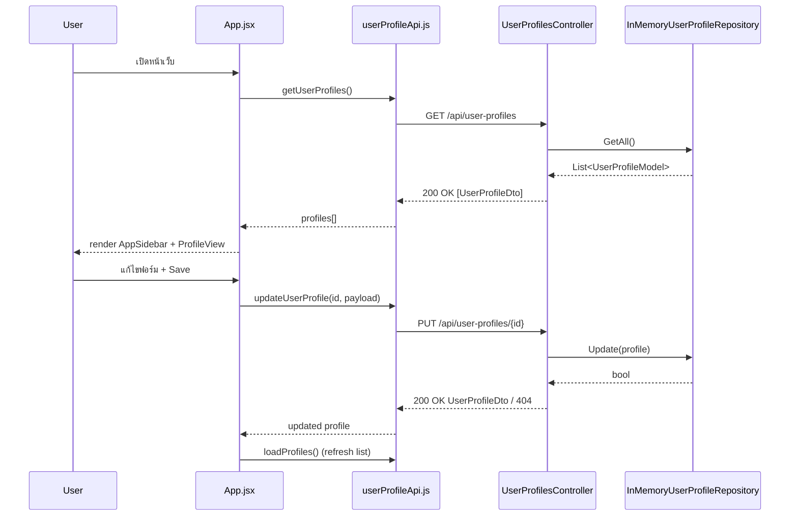

# Software Design Specification (SDS) — User Profile Web Application

## 1. ภาพรวมระบบ

เว็บแอปพลิเคชันสำหรับดู/เพิ่ม/แก้ไข/ลบข้อมูล User Profile ประกอบด้วย 2 ส่วนหลัก:

- **Frontend:** React 19 + Vite (SPA) — `http://localhost:5173`
- **Backend:** ASP.NET Core Web API บน .NET 10 — `http://localhost:5019`



ข้อมูลทั้งหมดเก็บใน memory ฝั่ง backend เท่านั้น (ไม่มีฐานข้อมูลถาวร) — รีเซ็ตทุกครั้งที่รีสตาร์ท API

> เอกสารที่เกี่ยวข้อง: [API-Spec.md](API-Spec.md) (รายละเอียด REST endpoints), [USER_MANUAL.md](USER_MANUAL.md) (คู่มือการใช้งานสำหรับผู้ใช้ทั่วไป พร้อมภาพหน้าจอ)

## 2. สถาปัตยกรรม

### 2.1 Backend — Vertical Slice Architecture (เป้าหมาย) / ปัจจุบันเป็น Layered

โครงสร้างปัจจุบัน (layer ตามชนิดไฟล์):

```
backend/
  Controllers/UserProfilesController.cs   REST endpoints ทั้งหมด (GET/GET-by-id/POST/PUT/DELETE)
  Dtos/UserProfileDtos.cs                 UserProfileDto (response) + UpsertUserProfileRequest (request + validation)
  Models/UserProfile.cs                   UserProfileModel (entity)
  Repositories/UserProfileRepository.cs   IUserProfileRepository + InMemoryUserProfileRepository
  Program.cs                              DI, CORS, Middleware pipeline
```

**ฟีเจอร์ใหม่ต้องจัดกลุ่มตาม use-case** ใต้ `Features/<FeatureArea>/<UseCase>/` แทนการเพิ่มลง `Controllers/` เดิม เช่น:

```
Features/UserProfiles/
  GetUserProfiles/
  GetUserProfileById/
  CreateUserProfile/
  UpdateUserProfile/
  DeleteUserProfile/
```

`Models/UserProfile.cs` และ `Repositories/UserProfileRepository.cs` เป็น shared core ใช้ร่วมกันได้ทุก slice

### 2.2 Frontend — Atomic Design (เป้าหมาย) / ปัจจุบัน flat

โครงสร้างปัจจุบัน (`frontend/src/components/`, flat):

| Component | บทบาท |
|---|---|
| `App.jsx` | root state container: `profiles`, `selectedId`, `mode` (`view/edit/create`), `loading`, `saving`, `error`, `theme`, `sidebarOpen`; เรียก API และประกอบ layout |
| `TopBar.jsx` | แถบบนสุด: ปุ่มเปิด sidebar (mobile), toggle theme |
| `AppSidebar.jsx` | รายชื่อโปรไฟล์ + ปุ่มสร้างใหม่ + responsive drawer |
| `ProfileList.jsx` | แสดงรายการโปรไฟล์ (ใช้ร่วมกับ/แทน AppSidebar ตามบริบท) |
| `ProfileView.jsx` | แสดงรายละเอียดโปรไฟล์ที่เลือก พร้อมปุ่ม Edit/Delete — ประกอบ `ProfileHero`, `ProfileTabs`, `IntroductionPanel` |
| `ProfileHero.jsx` | ส่วน hero: cover image, avatar, ชื่อ, stats, tab navigation |
| `ProfileTabs.jsx` | tab navigation ภายใน hero |
| `IntroductionPanel.jsx` | แสดง bio/email/phone/last-updated พร้อมไอคอน (lucide-react) |
| `ProfileForm.jsx` | ฟอร์มสร้าง/แก้ไขโปรไฟล์ (โหมด create/edit) |

ระดับ Atomic Design เป้าหมาย (จัดกลุ่มเมื่อแก้ไขไฟล์นั้น ไม่ต้อง refactor ทั้งหมดพร้อมกัน):

| ระดับ | โฟลเดอร์ | ตัวอย่างในโปรเจกต์นี้ |
|---|---|---|
| Atoms | `components/atoms/` | Button, Input, Avatar, Icon, Badge (ยังไม่แยก) |
| Molecules | `components/molecules/` | `ProfileTabs`, `IntroductionPanel` |
| Organisms | `components/organisms/` | `ProfileHero`, `ProfileForm`, `ProfileList`, `AppSidebar`, `TopBar` |
| Templates | `components/templates/` | โครง layout (sidebar + content) |
| Pages | `components/pages/` หรือ `App.jsx` | `ProfileView` |

กติกา: atom/molecule ห้ามเรียก API ตรง — ดึงข้อมูลที่ระดับ page/organism แล้วส่งผ่าน props; ไอคอนทั้งหมดใช้ `lucide-react`

## 3. UI Screens (Captured via Playwright MCP)

ภาพหน้าจอด้านล่างถูกจับด้วย Playwright MCP บนแอปที่รันจริง (`http://localhost:5173`) เพื่อประกอบเอกสารออกแบบและใช้เป็นฐานอ้างอิงให้ [USER_MANUAL.md](USER_MANUAL.md)

| Screen | ภาพ | คำอธิบาย |
|---|---|---|
| Profile view (desktop, 1440×900) |  | หน้าแสดงรายละเอียดโปรไฟล์ — `ProfileHero` + `IntroductionPanel` + `Profile details` |
| Edit form (desktop) |  | `ProfileForm` โหมดแก้ไข prefill ข้อมูลเดิม |
| Create form (desktop) |  | `ProfileForm` โหมดสร้างใหม่ ฟิลด์ว่างทั้งหมด |
| Mobile view (390×844) |  | Responsive layout เมื่อจอแคบ — sidebar ถูกซ่อนเป็น drawer |
| Mobile sidebar drawer |  | `AppSidebar` แบบ overlay drawer เมื่อกดปุ่มเมนูใน `TopBar` |

## 4. Data Flow



- Frontend เรียก API ผ่าน `src/api/userProfileApi.js` เท่านั้น (`fetch` + `handleResponse` แปลง error/204 ให้เป็นมาตรฐานเดียวกัน) — ห้าม component เรียก `fetch` ตรง
- Base URL มาจาก `VITE_API_BASE_URL` (default `http://localhost:5019`)

## 5. Data Model

### Entity — `UserProfileModel` (backend, in-memory)

| Field | Type |
|---|---|
| `Id` | `Guid` |
| `FirstName` | `string` |
| `LastName` | `string` |
| `Email` | `string` |
| `PhoneNumber` | `string` |
| `Bio` | `string` |
| `AvatarUrl` | `string` |
| `CreatedAt` | `DateTime` (UTC) |
| `UpdatedAt` | `DateTime` (UTC) |

### DTOs

- `UserProfileDto` (response): เหมือน entity ทุก field (immutable `record`)
- `UpsertUserProfileRequest` (request, ใช้ทั้ง Create/Update): `FirstName`/`LastName` required ≤50 ตัวอักษร, `Email` required + email format, `PhoneNumber` ≤20, `Bio` ≤500, `AvatarUrl` ≤300 — validate ด้วย DataAnnotations (`[Required]`, `[StringLength]`, `[EmailAddress]`)

รายละเอียด endpoint ทั้งหมด (request/response, status codes) ดูที่ [API-Spec.md](API-Spec.md)

## 6. Cross-Cutting Concerns

- **CORS:** อนุญาตเฉพาะ origin `http://localhost:5173` และ `http://localhost:3000` (`AllowAnyHeader`, `AllowAnyMethod`) — กำหนดใน `Program.cs`
- **Persistence:** `ConcurrentDictionary<Guid, UserProfileModel>` แบบ singleton DI (`IUserProfileRepository`) — thread-safe แต่ไม่ persist ข้ามการรีสตาร์ท; seed ข้อมูลตัวอย่าง 1 รายการตอนเริ่มระบบ
- **Validation:** ฝั่ง backend ใช้ DataAnnotations บน `UpsertUserProfileRequest`; ASP.NET Core คืน `400 Bad Request` แบบ `ProblemDetails` อัตโนมัติเมื่อ model ไม่ผ่าน
- **Error handling (frontend):** `handleResponse()` ใน `userProfileApi.js` throw `Error` เมื่อ `response.ok === false`; `App.jsx` เก็บ error message ใน state `error` เพื่อแสดงผล
- **State management (frontend):** ไม่ใช้ external state library — ใช้ React `useState`/`useEffect` ใน `App.jsx` เป็น single source of truth แล้วส่งผ่าน props ลงไปยัง organisms

## 7. Build & Run

```bash
# Backend — http://localhost:5019
cd backend && dotnet run

# Frontend — http://localhost:5173
cd frontend && npm install && npm run dev
```

Build check: `dotnet build` (backend), `npm run build` (frontend)

## 8. ข้อจำกัดที่ทราบ (Known Limitations)

- ไม่มี authentication/authorization
- ไม่มี persistent storage (ข้อมูลหายเมื่อรีสตาร์ท backend)
- ไม่มี pagination บน `GET /api/user-profiles` (คืนทั้งหมดในครั้งเดียว)
- Backend ยังไม่ได้ refactor เป็น Vertical Slice เต็มรูปแบบ (เป็น layered architecture ปัจจุบัน)

## 9. ภาพหน้าจอเพิ่มเติมและคู่มือผู้ใช้

ภาพหน้าจอฉบับเต็มพร้อมขั้นตอนการใช้งานทีละหน้าจอ (สร้าง/แก้ไข/ลบโปรไฟล์) อยู่ที่ [USER_MANUAL.md](USER_MANUAL.md) — ภาพทั้งหมดถูกจับด้วย Playwright MCP จากแอปที่รันจริงที่ `docs/screenshots/`
