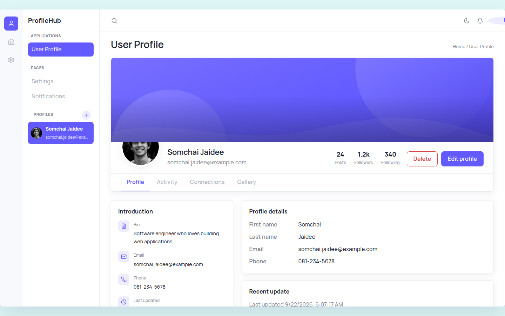
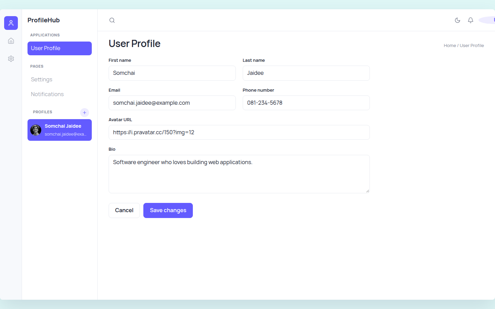
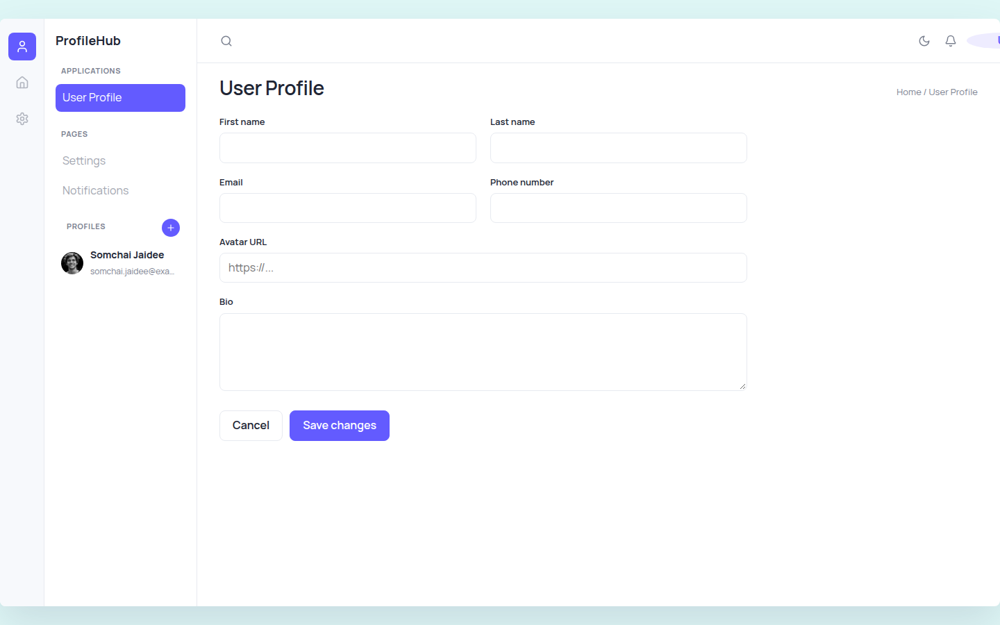
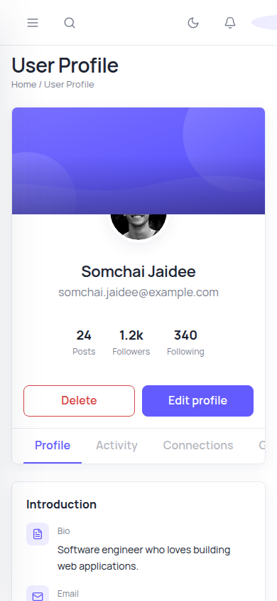
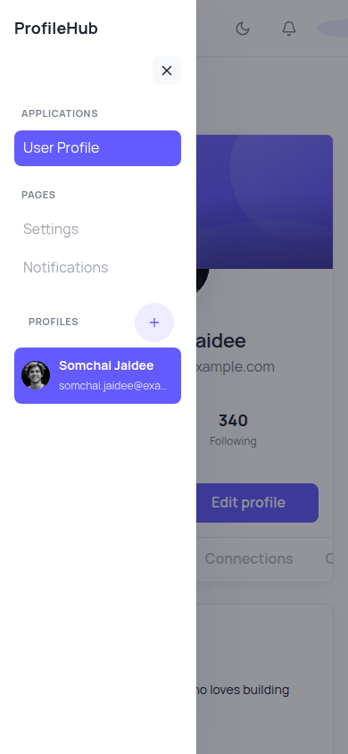

# คู่มือการใช้งาน (User Manual) — User Profile Web Application

เว็บแอปสำหรับดู เพิ่ม แก้ไข และลบข้อมูลโปรไฟล์ผู้ใช้ ภาพประกอบในคู่มือนี้จับภาพจากแอปที่รันจริงด้วย Playwright MCP (`http://localhost:5173`)

## เริ่มต้นใช้งาน

```bash
# Terminal 1: Backend
cd backend && dotnet run

# Terminal 2: Frontend
cd frontend && npm install && npm run dev
```

เปิดเบราว์เซอร์ที่ `http://localhost:5173`

## 1. หน้าดูรายละเอียดโปรไฟล์ (Profile View)



เมื่อเปิดแอป ระบบจะแสดงโปรไฟล์แรกในรายการทางด้าน sidebar ซ้ายมือโดยอัตโนมัติ ส่วนหลักประกอบด้วย:

- **Sidebar (ซ้าย):** รายชื่อโปรไฟล์ทั้งหมด + ปุ่ม **Create profile** (ไอคอน `+`) มุมขวาบนของหัวข้อ "Profiles" — คลิกชื่อในรายการเพื่อสลับดูโปรไฟล์อื่น
- **Hero section:** รูปปก, รูปโปรไฟล์, ชื่อ-อีเมล, สถิติ (Posts/Followers/Following), ปุ่ม **Delete** และ **Edit profile**
- **แท็บ Profile:** แสดง Introduction (Bio, Email, Phone, Last updated) และ Profile details (First/Last name, Email, Phone)
- แท็บ Activity / Connections / Gallery ยังไม่เปิดใช้งาน (coming soon)

## 2. แก้ไขโปรไฟล์ (Edit)



1. กดปุ่ม **Edit profile** จากหน้ารายละเอียด
2. ฟอร์มจะแสดงข้อมูลเดิม (First name, Last name, Email, Phone number, Avatar URL, Bio) ให้แก้ไข
3. กด **Save changes** เพื่อบันทึก หรือ **Cancel** เพื่อยกเลิกและกลับไปหน้าดูรายละเอียด
4. หากข้อมูลไม่ผ่านการตรวจสอบ (เช่น อีเมลไม่ถูกรูปแบบ) ระบบจะแสดงข้อความ error

## 3. สร้างโปรไฟล์ใหม่ (Create)



1. กดปุ่ม **+ (Create profile)** ที่ sidebar
2. กรอกข้อมูลในฟอร์มเปล่า (First name และ Last name และ Email จำเป็นต้องกรอก)
3. กด **Save changes** — โปรไฟล์ใหม่จะถูกเพิ่มเข้ารายการและถูกเลือกแสดงทันที

## 4. ลบโปรไฟล์ (Delete)

จากหน้าดูรายละเอียด กดปุ่ม **Delete** สีแดง แล้วยืนยันในกล่องโต้ตอบที่ปรากฏ — โปรไฟล์จะถูกลบออกจากรายการทันที (ข้อมูลลบแล้วกู้คืนไม่ได้ เนื่องจากเก็บใน memory เท่านั้น)

## 5. การใช้งานบนมือถือ (Mobile / Responsive)

| Mobile view | Mobile sidebar drawer |
|---|---|
|  |  |

บนหน้าจอขนาดเล็ก sidebar จะถูกซ่อนเป็นเมนูแบบ drawer — แตะไอคอนเมนู (☰) มุมซ้ายบนของ TopBar เพื่อเปิด/ปิดรายการโปรไฟล์และปุ่มสร้างใหม่

## 6. ปุ่มอื่น ๆ บน Top Bar

- **ไอคอนค้นหา (🔍):** ช่องค้นหา (ยังไม่เปิดใช้งาน)
- **ไอคอนพระจันทร์/พระอาทิตย์:** สลับธีม Light/Dark
- **ไอคอนกระดิ่ง:** การแจ้งเตือน (ยังไม่เปิดใช้งาน)

## หมายเหตุ

- ข้อมูลทั้งหมดเก็บใน memory ฝั่ง backend เท่านั้น — จะรีเซ็ตกลับเป็นข้อมูลตัวอย่างทุกครั้งที่รีสตาร์ท backend
- รายละเอียดเชิงเทคนิคของ API ดูที่ [API-Spec.md](API-Spec.md), ภาพรวมสถาปัตยกรรมดูที่ [SDS.md](SDS.md)
