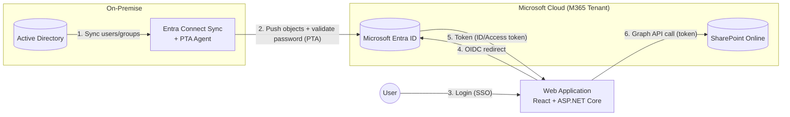
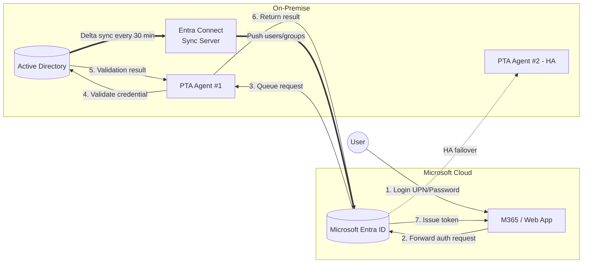
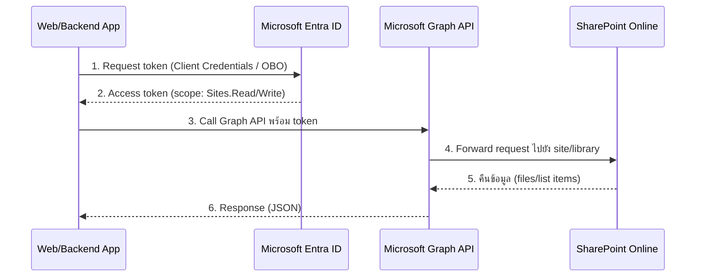
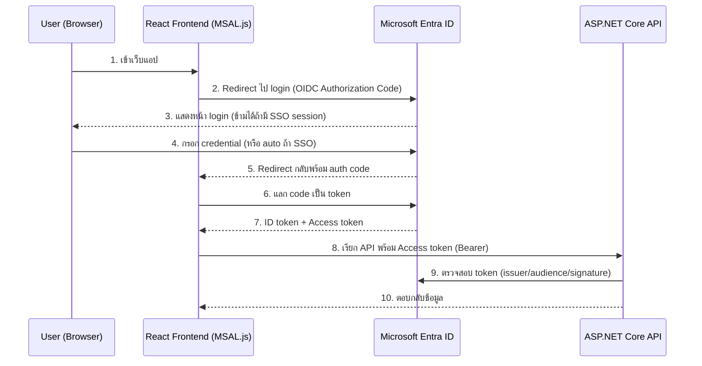

# Requirement Specification: AD On-Premise Sync, SharePoint Online, และ Web Application SSO

## 1. ภาพรวม (Overview)

เอกสารนี้สรุป requirement และแนวทางการดำเนินงานสำหรับ 3 งานหลัก พร้อมระบุขอบเขตความรับผิดชอบของแต่ละทีม (Infra / Developer) เพื่อให้ทั้งสองทีมเห็นภาพตรงกันก่อนเริ่มงาน

| # | Requirement | สถานะ |
|---|---|---|
| 1 | เชื่อม AD On-Premise Sync กับ Entra ID (M365) | รอดำเนินการ |
| 2 | เชื่อมต่อกับ SharePoint Online | รอดำเนินการ |
| 3 | Web Application Login SSO | รอดำเนินการ |

### Diagram ภาพรวมสถาปัตยกรรม



---

## 2. AD On-Premise Sync กับ Entra ID (M365)

### วัตถุประสงค์
ซิงค์ข้อมูลผู้ใช้/กลุ่ม (Users, Groups, Attributes) จาก Active Directory on-premise ขึ้นไปยัง Microsoft Entra ID (Azure AD) เพื่อให้บัญชีผู้ใช้เดียวใช้งานได้ทั้งระบบภายในองค์กรและบริการ M365

### แนวทางดำเนินการ
- ติดตั้ง **Microsoft Entra Connect Sync** (เดิมชื่อ Azure AD Connect) บน server ภายในองค์กร
- กำหนดรูปแบบการ sync: Password Hash Sync (PHS) หรือ Pass-through Authentication (PTA) หรือ Federation (ADFS) ตามนโยบายความปลอดภัย
- กำหนด OU/Scope ที่ต้องการ sync และ attribute mapping (เช่น UPN, mail, employeeId)
- ตั้งค่า sync schedule และ conflict resolution rule
- ทดสอบการ sync แบบ staging mode ก่อนใช้งานจริง
- วางแผน high availability (Staging Server สำรอง)

### Diagram: PTA Authentication & Sync Flow



### ความรับผิดชอบของแต่ละทีม

**ทีม Infra**
- ติดตั้งและดูแล Entra Connect Sync server
- กำหนดโครงสร้าง AD, OU, Security Group ที่จะ sync
- ตั้งค่า network/firewall ให้ server ติดต่อ Entra ID ได้ (outbound HTTPS 443/80)
- ดูแล certificate, service account ที่ใช้ sync
- Monitor sync health (Entra Connect Health) และแก้ปัญหา sync error
- กำหนดนโยบาย password policy / MFA ให้สอดคล้องกับบัญชีที่ sync ขึ้นไป

**ทีม Developer**
- ไม่เกี่ยวข้องโดยตรงกับการ sync แต่ต้องทราบ attribute ที่มีอยู่จริงหลัง sync (เช่น UPN, ObjectId, mail) เพื่อใช้ mapping กับข้อมูลผู้ใช้ในระบบแอปพลิเคชัน
- ประสานงานกับ Infra เพื่อขอ test account สำหรับพัฒนา/ทดสอบระบบที่ต้องใช้ identity จริง

### สภาพแวดล้อมของทีม (สรุปจากข้อมูลที่ได้รับ)
- AD: Single forest/domain
- Authentication method: **Pass-through Authentication (PTA)**
- Entra ID tenant: มีอยู่แล้ว พร้อมสิทธิ์ Global Admin
- Sync scope: sync ผู้ใช้/กลุ่มทั้งหมด (All OUs)
- Server: มี Windows Server พร้อมใช้งานสำหรับติดตั้ง Entra Connect

### ขั้นตอนดำเนินการ (Step-by-Step) — เฉพาะกรณี PTA + Single Domain + Sync ทั้งหมด

#### Step 1: เตรียม Prerequisites
- Windows Server 2019/2022 (join domain แล้ว), RAM ≥ 4GB, .NET Framework 4.8+
- บัญชี **Enterprise Admin** หรือ **Domain Admin** บน AD (สำหรับสร้าง service account / configure sync)
- บัญชี **Global Administrator** บน Entra ID tenant (สำหรับ enable PTA และ authorize agent)
- เปิด outbound firewall ไปยัง endpoint ของ Microsoft (443, 80) — ตรวจสอบด้วย Microsoft Remote Connectivity Analyzer หรือ `Test-NetConnection`
- Verify custom domain (เช่น `contoso.com`) บน Entra ID แล้ว (Domains > Add custom domain) ก่อน sync UPN ที่ไม่ใช่ `.onmicrosoft.com`

```powershell
# ตรวจสอบว่า server เชื่อมต่อ endpoint ที่จำเป็นได้ (รันบน server ที่จะติดตั้ง Entra Connect)
Test-NetConnection -ComputerName login.microsoftonline.com -Port 443
Test-NetConnection -ComputerName secure.aadcdn.microsoftonline-p.com -Port 443
```

#### Step 2: ดาวน์โหลดและติดตั้ง Microsoft Entra Connect Sync
1. ดาวน์โหลดตัวติดตั้งล่าสุดจากหน้า Entra admin center (Entra ID > Entra Connect > Download Entra Connect)
2. รันตัวติดตั้งบน server → เลือก **Customize** (ไม่ใช้ Express) เพื่อกำหนดค่าเอง
3. เลือกหน้า **User sign-in** → เลือก **Pass-through Authentication**
4. เลือก **Enable single sign-on** (ถ้าต้องการ seamless SSO ร่วมกับ PTA)
5. Login ด้วย Global Admin เพื่อเชื่อมต่อ tenant
6. หน้า Connect your directories → เลือก forest ปัจจุบัน แล้ว login ด้วย Enterprise Admin
7. หน้า Domain/OU filtering → เลือก **Sync all domains and OUs** (ตามที่กำหนด scope ทั้งหมด)
8. หน้า Uniquely identifying your users → ปล่อย default (mS-DS-ConsistencyGuid) ถ้าไม่มี multi-forest merge
9. หน้า Filter users and devices → เลือก sync ทั้งหมด (ไม่ filter เพิ่ม)
10. หน้า Optional features → เลือกตามต้องการ เช่น **Password writeback** (ถ้าต้องการให้ user เปลี่ยน password จาก cloud สะท้อนกลับ on-prem)
11. กด Install — ระบบจะสร้าง OU `AAD_PasswordProtection` service account (`MSOL_xxxx`) และ config sync engine ให้อัตโนมัติ

#### Step 3: ตรวจสอบ PTA Agent
```powershell
# รันบน server ที่ติดตั้ง Entra Connect เพื่อดูสถานะ agent
Get-Service -Name "AADConnectProvisioningAgent", "AzureADConnectAuthenticationAgent" |
    Select-Object Name, Status
```
- ตรวจสอบใน Entra admin center: **Entra ID > Entra Connect > Pass-through authentication** ต้องขึ้นสถานะ **Active** อย่างน้อย 1 agent (แนะนำติดตั้ง agent สำรองอีก 1–2 เครื่องเพื่อ high availability)

#### Step 4: ตรวจสอบผลการ Sync
```powershell
# ตรวจสอบรอบ sync ล่าสุดและสถานะ
Get-ADSyncScheduler

# สั่ง sync แบบ delta ทันที (ทดสอบ)
Start-ADSyncSyncCycle -PolicyType Delta

# ดู log การ sync ล่าสุด (Synchronization Service Manager)
# Start > Synchronization Service Manager > แท็บ Operations
```
- เข้า Entra admin center > **Users** เพื่อตรวจสอบว่าผู้ใช้จาก AD ปรากฏขึ้นมาครบ พร้อม attribute ที่ถูกต้อง (UPN, mail, department ฯลฯ)

#### Step 5: ทดสอบ Authentication ผ่าน PTA
1. สร้าง/ใช้ test user ที่ sync ขึ้นไปแล้ว
2. เข้า `https://myaccount.microsoft.com` แล้ว login ด้วย UPN + password จริงของ on-prem AD
3. ตรวจสอบว่า login สำเร็จโดยไม่ต้องสร้าง password แยกใน cloud (แปลว่า PTA ทำงานถูกต้อง)
4. ทดสอบ scenario: เปลี่ยน password บน AD on-prem → ต้อง login ด้วย password ใหม่ได้ทันที (ไม่มี delay เพราะ PTA เช็ค real-time)

#### Step 6: Monitoring & High Availability
- ติดตั้ง **Entra Connect Health** agent เพื่อ monitor sync errors, agent availability แบบ dashboard
- ติดตั้ง PTA agent เพิ่มอีกอย่างน้อย 1 เครื่องบน server อื่น (Download-only agent จาก Entra admin center) เพื่อไม่ให้ authentication ล่มถ้า agent หลักดับ
- ตั้ง alert เมื่อ agent status เป็น **Inactive** เกิน 10 นาที

### ตัวอย่าง Checklist สำหรับทีม Infra
- [ ] Server ติดตั้ง Entra Connect พร้อม join domain แล้ว
- [ ] Verify custom domain บน Entra ID เรียบร้อย
- [ ] ติดตั้ง Entra Connect แบบ Custom + เลือก PTA
- [ ] PTA Agent status = Active (≥ 2 เครื่องเพื่อ HA)
- [ ] รอบ sync (Delta) ทำงานทุก 30 นาทีตาม default scheduler
- [ ] ทดสอบ login ด้วย test user ผ่าน `myaccount.microsoft.com` สำเร็จ
- [ ] เปิดใช้งาน Entra Connect Health monitoring

---

## 3. เชื่อมต่อกับ SharePoint Online

### วัตถุประสงค์
ให้ระบบ/แอปพลิเคชันสามารถอ่าน-เขียนข้อมูล (ไฟล์, list, document library) บน SharePoint Online ได้ผ่านสิทธิ์ที่ควบคุมได้ปลอดภัย

### แนวทางดำเนินการ
- สร้าง **App Registration** บน Entra ID สำหรับแอปพลิเคชันที่จะเรียกใช้งาน
- เลือกวิธีเชื่อมต่อ: **Microsoft Graph API** (แนะนำ) หรือ SharePoint REST API / PnP JS / PnP PowerShell
- กำหนด API Permission ที่จำเป็น (เช่น `Sites.Read.All`, `Sites.ReadWrite.All`) แบบ least privilege และผ่าน admin consent
- ตัดสินใจรูปแบบ auth: Application permission (app-only, ใช้ client secret/certificate) หรือ Delegated permission (ผูกกับ user ที่ login)
- ออกแบบ folder/site structure บน SharePoint Online ที่จะใช้งานร่วมกับระบบ

### Diagram: การเรียกใช้งาน SharePoint Online ผ่าน Graph API



### ความรับผิดชอบของแต่ละทีม

**ทีม Infra**
- สร้างและดูแล SharePoint Online site collection / document library
- สร้าง App Registration, ออก client secret/certificate, และอนุมัติ API permission (admin consent)
- กำหนดสิทธิ์การเข้าถึง site/library ระดับ security group
- ดูแล license M365 ที่เกี่ยวข้องกับ SharePoint Online

**ทีม Developer**
- พัฒนาโค้ดเรียก Microsoft Graph API / SharePoint REST API เพื่ออ่าน-เขียนข้อมูล
- จัดการ token acquisition (Client Credentials flow หรือ On-Behalf-Of flow ตามกรณีใช้งาน)
- จัดการ error handling, retry, throttling ตาม Graph API rate limit
- เขียน integration test เชื่อมต่อกับ SharePoint Online sandbox/dev site

---

## 4. Web Application Login SSO

### วัตถุประสงค์
ให้ผู้ใช้ล็อกอินเข้าเว็บแอปพลิเคชันด้วยบัญชี Entra ID (M365) เดียวกัน โดยไม่ต้องสร้าง credential แยกต่างหาก (Single Sign-On)

### แนวทางดำเนินการ
- สร้าง **App Registration** แยกสำหรับ web application (Redirect URI, Logout URL)
- เลือก protocol: **OpenID Connect / OAuth 2.0** ผ่าน Microsoft Entra ID
- ฝั่ง Frontend/Backend ใช้ไลบรารี **MSAL** (MSAL.js สำหรับ SPA/React, Microsoft.Identity.Web สำหรับ ASP.NET Core)
- กำหนด token validation (issuer, audience, signing key จาก Entra ID)
- ออกแบบ session/refresh token handling และ logout flow (single sign-out)
- กำหนดนโยบาย Conditional Access / MFA ตามความเสี่ยงของแอป
### Diagram: Web Application Login SSO (OIDC)


### ความรับผิดชอบของแต่ละทีม

**ทีม Infra**
- สร้าง App Registration บน Entra ID สำหรับ web application
- กำหนด Redirect URI, Logout URI ตาม environment (dev/staging/prod)
- ตั้งค่า Conditional Access Policy, MFA, Sign-in risk policy
- ออก client secret/certificate และดูแลอายุการใช้งาน (rotation)
- Monitor sign-in logs ผ่าน Entra ID เพื่อตรวจสอบความผิดปกติ

**ทีม Developer**
- Integrate MSAL library เข้ากับ frontend (React) และ/หรือ backend (ASP.NET Core)
- Implement OIDC login/logout flow, token acquisition, และ token refresh
- Validate JWT token ฝั่ง backend API (issuer, audience, signature, expiry)
- จัดการ role/claim mapping จาก Entra ID มาเป็นสิทธิ์การใช้งานในแอป (Authorization)
- เขียน test ครอบคลุม login/logout/token expiry scenario

---

## 5. สรุปตารางความรับผิดชอบ (RACI แบบย่อ)

| งาน | Infra | Developer |
|---|---|---|
| ติดตั้ง/ดูแล Entra Connect Sync | R/A | I |
| กำหนด attribute mapping AD → Entra ID | R/A | C |
| สร้าง App Registration (SharePoint, Web App) | R/A | C |
| อนุมัติ API Permission / Admin Consent | R/A | C |
| พัฒนาโค้ดเรียก Graph API / SharePoint API | I | R/A |
| พัฒนา SSO login (MSAL, OIDC) ฝั่งแอป | I | R/A |
| Token validation ฝั่ง backend | C | R/A |
| Conditional Access / MFA Policy | R/A | I |
| Monitor sign-in logs / sync health | R/A | I |

> R = Responsible, A = Accountable, C = Consulted, I = Informed

## 6. Dependencies ที่ต้องเตรียมก่อนเริ่มงาน
- สิทธิ์ Global Administrator หรือ Application Administrator บน Entra ID (สำหรับสร้าง App Registration และ admin consent)
- License M365 ที่รองรับ SharePoint Online และ Entra ID Sync
- Server on-premise สำหรับติดตั้ง Entra Connect Sync (พร้อม network เปิด outbound HTTPS)
- Test/Dev tenant หรือ dev site สำหรับทดสอบก่อนขึ้น production
