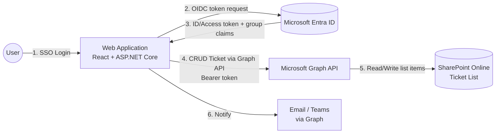
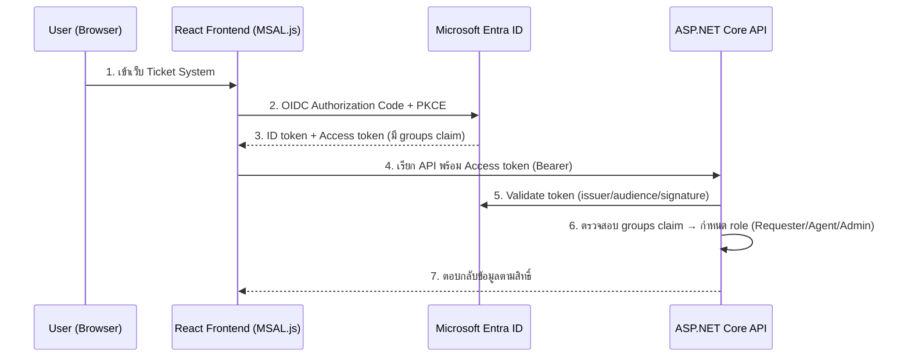
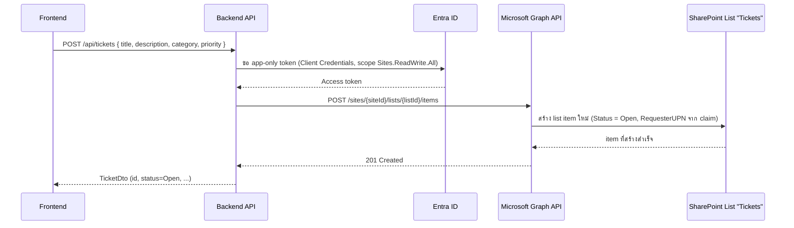
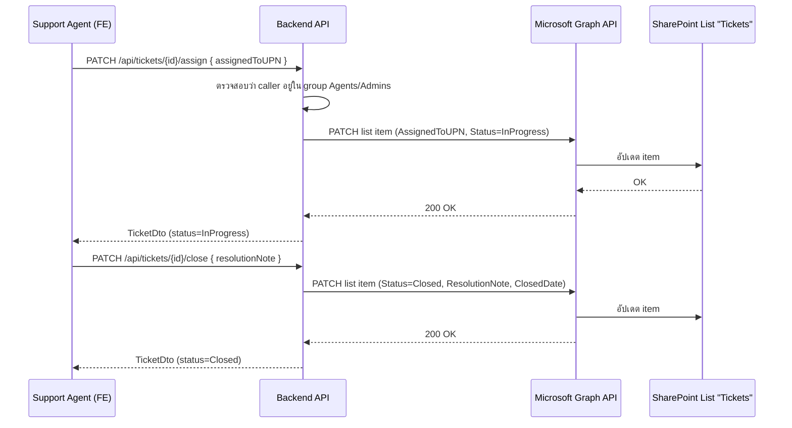
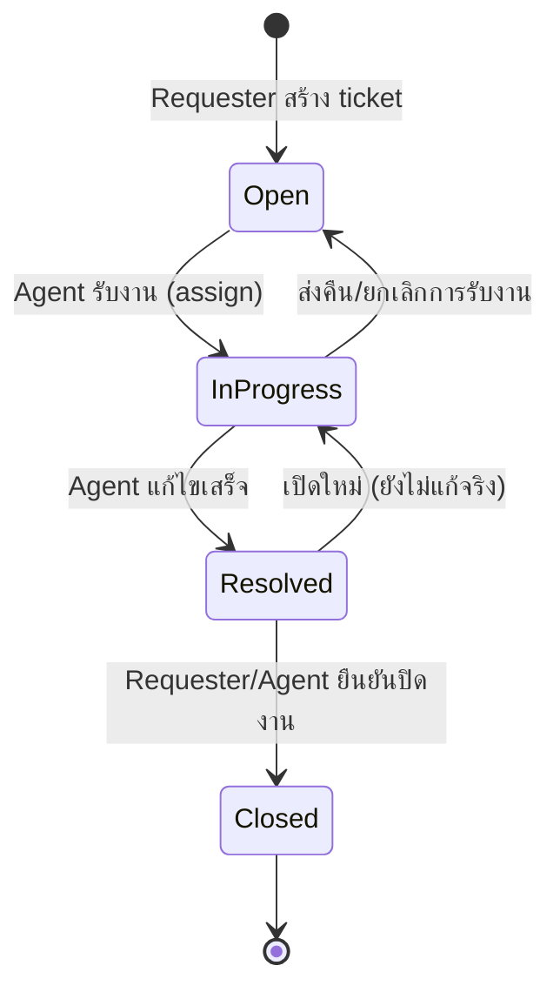

# ระบบ Ticket โดยใช้ SharePoint List + Microsoft Entra ID

## 1. ภาพรวม (Overview)

เอกสารนี้อธิบายแนวทางออกแบบ **ระบบ Ticket (Helpdesk/Request Ticket)** โดยผสาน 2 องค์ประกอบที่ระบุไว้ใน [REQUIREMENTS_AD_ENTRA_SSO.md](REQUIREMENTS_AD_ENTRA_SSO.md) เข้าด้วยกัน:

- **SharePoint Online List** ทำหน้าที่เป็นแหล่งเก็บข้อมูล (data store) ของ Ticket แทนฐานข้อมูลแบบ SQL — ใช้ list column เป็น schema, ใช้ Microsoft Graph API ในการอ่าน/เขียน
- **Microsoft Entra ID** ทำหน้าที่เป็นระบบยืนยันตัวตน/สิทธิ์ (Authentication & Authorization) — ผู้ใช้ล็อกอินด้วยบัญชีองค์กรเดียว (SSO) และสิทธิ์การใช้งาน Ticket (สร้าง/แก้ไข/ปิด) ผูกกับ Entra ID Group/Role

### Diagram ภาพรวมสถาปัตยกรรม

---

## 2. เหตุผลที่เลือกใช้ SharePoint List เป็นแหล่งเก็บ Ticket

- ไม่ต้องตั้งฐานข้อมูลใหม่ — องค์กรมี M365/SharePoint Online อยู่แล้ว ลดต้นทุน infra
- ผู้ดูแลระบบที่ไม่ใช่ developer (เช่น IT Support Lead) สามารถปรับ column, view, alert ผ่านหน้า SharePoint ได้โดยตรง
- รองรับ attachment (แนบไฟล์ประกอบ ticket) และ version history ในตัว
- เชื่อมต่อ Power Automate ได้ทันทีถ้าต้องการ workflow แจ้งเตือนเพิ่มเติมในอนาคต

ข้อจำกัดที่ต้องรับทราบ:
- Throttling ของ Microsoft Graph API (ควรมี retry/backoff)
- ไม่เหมาะกับ query ที่ซับซ้อนมาก (join หลายตาราง) — ถ้า scope ใหญ่ขึ้นควรพิจารณาย้ายไป SQL ในอนาคต
- List item ต่อ list เดียวไม่ควรเกิน ~5,000 รายการต่อ view โดยไม่ทำ indexing/filter ให้ดี (SharePoint list threshold)

---

## 3. Data Model — SharePoint List "Tickets"

สร้าง SharePoint List ชื่อ `Tickets` บน site ที่กำหนด พร้อม column ดังนี้:

| Column (Internal Name) | ชนิดข้อมูล | คำอธิบาย |
|---|---|---|
| `Title` | Single line of text | หัวข้อ Ticket |
| `Description` | Multiple lines of text | รายละเอียดปัญหา/คำขอ |
| `Category` | Choice (Hardware, Software, Network, Account, Other) | ประเภท Ticket |
| `Priority` | Choice (Low, Medium, High, Urgent) | ระดับความสำคัญ |
| `Status` | Choice (Open, InProgress, Resolved, Closed) | สถานะปัจจุบัน |
| `RequesterUPN` | Single line of text | UPN ของผู้แจ้ง (จาก Entra ID token) |
| `RequesterDisplayName` | Single line of text | ชื่อผู้แจ้ง (denormalized เพื่อลด lookup) |
| `AssignedToUPN` | Single line of text | UPN ของผู้รับผิดชอบ (support agent) |
| `Attachments` | Attachment (built-in) | ไฟล์แนบประกอบ ticket |
| `Created` / `Author` | built-in | วันที่สร้างและผู้สร้าง (SharePoint metadata) |
| `Modified` / `Editor` | built-in | วันที่แก้ไขล่าสุดและผู้แก้ไข |
| `ResolutionNote` | Multiple lines of text | บันทึกการแก้ไข/ปิดงาน |
| `ClosedDate` | Date and Time | วันที่ปิด Ticket |

> หมายเหตุ: ใช้ `RequesterUPN` / `AssignedToUPN` เป็น string (ไม่ใช่ Person column) เพื่อให้ backend เขียนผ่าน Graph API ได้ง่ายด้วย Application permission โดยไม่ต้อง resolve People Picker

---

## 4. สิทธิ์การใช้งาน (Role → Entra ID Group Mapping)

| Role | Entra ID Group | สิทธิ์ |
|---|---|---|
| Requester | `TicketSystem-Users` (ทุกคนใน org) | สร้าง ticket ของตัวเอง, ดู/แก้ไขเฉพาะ ticket ที่ตนแจ้ง |
| Support Agent | `TicketSystem-Agents` | ดู ticket ทั้งหมด, รับงาน (assign), เปลี่ยนสถานะ, บันทึก resolution |
| Admin | `TicketSystem-Admins` | จัดการ category/priority, ดู report, ลบ ticket |

Group membership เหล่านี้ sync มาจาก AD On-Premise ผ่าน Entra Connect (ตามที่ระบุใน [REQUIREMENTS_AD_ENTRA_SSO.md](REQUIREMENTS_AD_ENTRA_SSO.md#2-ad-on-premise-sync-กับ-entra-id-m365)) และแนบมาใน ID token เป็น `groups` claim เมื่อผู้ใช้ login ผ่าน SSO — backend ใช้ claim นี้ตัดสินใจสิทธิ์ (authorization) ก่อนเรียก Graph API

---

## 5. Flow การทำงานหลัก

### 5.1 Login และตรวจสอบสิทธิ์ (SSO)

### 5.2 สร้าง Ticket ใหม่

### 5.3 Support Agent รับงานและปิด Ticket

### 5.4 Ticket Status Lifecycle

---

## 6. การเชื่อมต่อ Graph API กับ SharePoint List (สรุปทางเทคนิค)

- **Auth flow ฝั่ง backend**: ใช้ **Client Credentials flow** (Application permission, `Sites.ReadWrite.All` แบบจำกัด scope ด้วย Application Access Policy ต่อ site เดียว) เพื่อให้ backend เป็นตัวกลางเขียนข้อมูลแทน user ทุกคน โดยยึด role จาก groups claim เป็นตัวคุมสิทธิ์ระดับ business logic
- Endpoint หลักที่ใช้:
  - `GET /sites/{siteId}/lists/{listId}/items?expand=fields` — ดึงรายการ ticket
  - `POST /sites/{siteId}/lists/{listId}/items` — สร้าง ticket
  - `PATCH /sites/{siteId}/lists/{listId}/items/{itemId}/fields` — แก้ไข ticket (status, assignee, resolution)
  - `POST /sites/{siteId}/lists/{listId}/items/{itemId}/driveItem/content` — แนบไฟล์ (attachment)
- ควรทำ **caching ระยะสั้น** (เช่น in-memory 30-60 วินาที) สำหรับ `GET` list เพื่อลด throttling จาก Graph API เมื่อมีผู้ใช้ refresh หน้าพร้อมกันจำนวนมาก
- ควร map field ระหว่าง Ticket DTO (backend) กับ SharePoint internal column name ผ่าน constant/config ไฟล์เดียว เพื่อไม่ให้ magic string กระจายในโค้ด

---

## 7. ความรับผิดชอบของแต่ละทีม

**ทีม Infra**
- สร้าง SharePoint site + List `Tickets` พร้อม column ตามหัวข้อ 3
- สร้าง Entra ID Groups (`TicketSystem-Users/Agents/Admins`) และจัดสมาชิก
- สร้าง App Registration สำหรับ backend, กำหนด Application permission (`Sites.Selected` หรือ `Sites.ReadWrite.All`) และอนุมัติ admin consent
- ตั้งค่า Application Access Policy จำกัดสิทธิ์ app ให้เข้าถึงเฉพาะ site ของ Ticket system (ไม่ใช่ทุก site ใน tenant)
- Monitor sign-in logs และ Graph API usage/throttling

**ทีม Developer**
- พัฒนา backend endpoints (`/api/tickets/*`) ตาม Vertical Slice Architecture (`Features/Tickets/CreateTicket`, `AssignTicket`, `CloseTicket`, `GetTickets` ฯลฯ)
- Implement Graph API client (token acquisition, retry/backoff สำหรับ throttling)
- Implement authorization ฝั่ง backend จาก `groups` claim ใน token
- พัฒนา frontend ตาม Atomic Design (เช่น `TicketForm`, `TicketList`, `TicketStatusBadge`, `TicketDetailPage`)
- เขียน integration test เชื่อมต่อ SharePoint list บน dev/test site ก่อนขึ้น production

---

## 8. Dependencies ที่ต้องเตรียมก่อนเริ่มงาน

- SharePoint Online site + List `Tickets` พร้อม column ครบตามหัวข้อ 3
- Entra ID Groups 3 กลุ่มพร้อมสมาชิกเริ่มต้นสำหรับทดสอบ
- App Registration (backend, application permission) ที่ผ่าน admin consent แล้ว
- สภาพแวดล้อม SSO (OIDC) ที่ใช้งานได้ตามที่ระบุใน [REQUIREMENTS_AD_ENTRA_SSO.md](REQUIREMENTS_AD_ENTRA_SSO.md#4-web-application-login-sso)
- Dev/test site แยกจาก production สำหรับทดสอบก่อน deploy จริง
